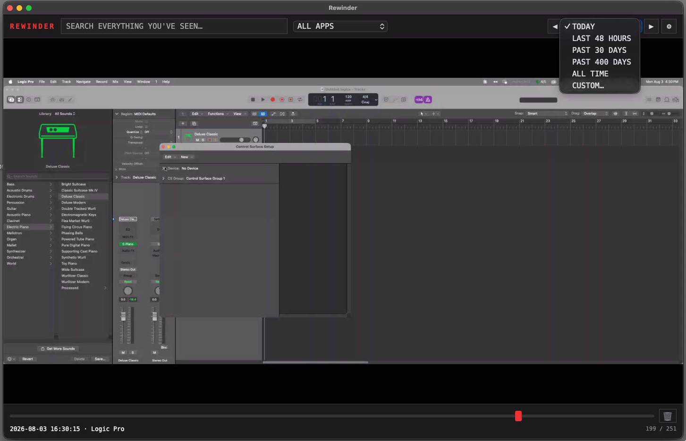
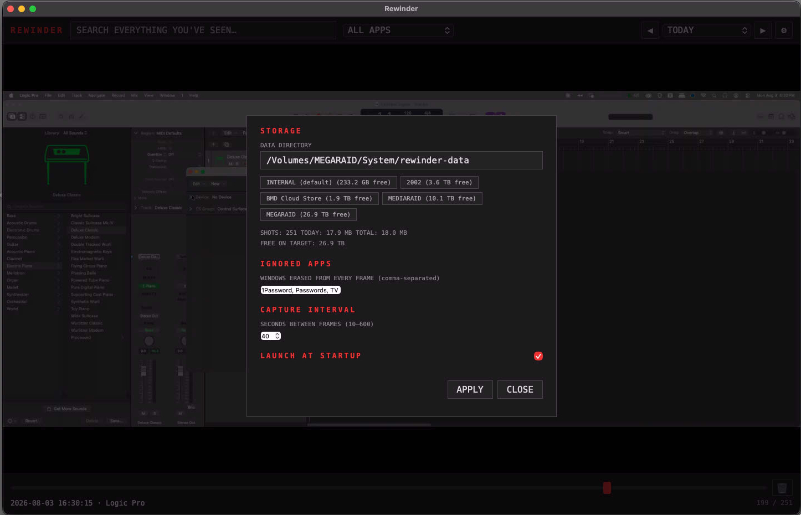
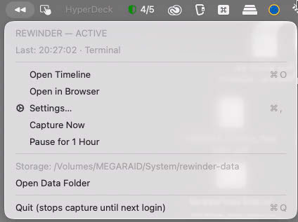

# Rewinder

A private, searchable visual history of everything you've seen on your Mac.
Rewinder quietly captures the active screen, OCRs every frame on-device with Apple's built-in engine.
Nothing leaves your computer. Ever. It's all locally processed and stored. No AI, No LLM, No training, nothing.



## Download

**[⬇ Get the latest Rewinder DMG](../../releases/latest)** — open it, drag
Rewinder into Applications, launch, and click **Allow** on the Screen
Recording prompt. That's the whole install.

Apple Silicon, macOS 14+. Signed and notarized — no Gatekeeper hoops.

## Features

- **Menu-bar app** — ◀◀ when active, ◁◁ when not; pause, capture-now, and
  settings from the dropdown
- **DRM-safe** — captures (like Cmd-Shift-3) never
  interrupts protected playback; DRM video just appears black in frames
- **Full-text search** of everything ever on screen (SQLite FTS5, on-device)
- **Timeline scrubbing** across ranges: today / 48 h / 30 d / 400 d / all
  time / custom date span
- **Per-app filter** — every frame is tagged with the frontmost app
- **Ignored apps** — Privacy first. Listed apps' windows are *excluded from the frame itself*
- **Idle dedup** — near-identical consecutive frames are skipped before OCR;
- **Tiny frames** — ~50 KB/frame, roughly 50–90 MB per working day
- **Storage manager** — point it at any volume; background migration, and a
  local spool if the volume is unmounted
- **Delete** — single frame, last hour, today, today+yesterday, or
  everything

## Screenshots

| Settings | Menu bar |
| --- | --- |
|  |  |

## Build from source

```sh
./build.sh            # compiles, assembles, and signs /Applications/Rewinder.app
```

Signing uses a certificate named in `build.sh`; adjust `CERT` to your own
identity. A stable signing identity is what keeps macOS permission grants
(Screen Recording etc.) across rebuilds.

## Architecture

- `app/Rewinder.swift` — menu-bar host: in-process capture (ScreenCaptureKit
  one-shot + Vision OCR + dedup fingerprint), settings sync, native WKWebView
  timeline window, launchd agent self-install
- `app/Server.swift` — embedded server on localhost:8787; indexes OCR
  sidecars into SQLite FTS5 and serves the UI + JSON API (in-process)
- `ui/index.html` — the timeline/search UI (vanilla JS, no dependencies)
- Frames live as `YYYY-MM-DD/HHMMSS.webp` + `.txt` (OCR) + `.json` (app tag)
  sidecars; the index can always be rebuilt from the sidecars
